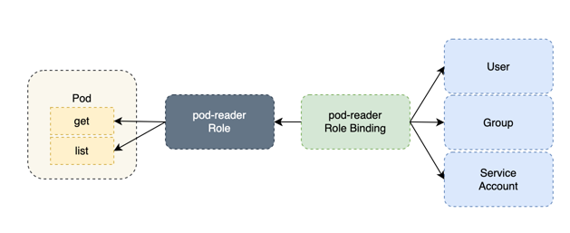

# k8s RBAC

상황:

1. A(admin)서버에서 B(api)서버의 resource(Pod)를 체크해야함
2. [k8s Client Libraries](https://github.com/kubernetes-client/java/)를 이용하여 A → B 서버 접근 시 에러가 발생함
3. 둘은 같은 클러스터 다른 네임스페이스에 존재함

# RBAC

(Role based Access Control: 역할 기반의 권한 인가 체계)

```
Role : 특정 네임스페이스에 한정된 정책
(특정 네임스페이스 + '어디서 무엇을 어떻게')

ClusterRole : 클러스터 전체에 한정된 정책
(클러스터 전체 + '어디서 무엇을 어떻게')

RoleBinding : 역할이 특정 네임스페이스에 한정된 정책을 따르도록 적용
(어떤 역할이 특정 네임스페이스에서 하는가?)

ClusterRoleBinding : 역할이 클러스터 전체에 한정된 정책을 따르도록 적용
(어떤 역할이 클러스터 전체에서 하는가?)

ServiceAccount : 권한을 관리하기 위한 쿠버네티스 오브젝트

User, Group..
```


### 설정 가능한 Resource

- pod
- service
- node
- daemonset
- deployment
- replicaset
- statefulset
- job
- cronjobs

### 설정 가능한 verbs
|HTTP 동사|	요청 동사|
|---|---|
POST|	create
GET, HEAD|	get(개별 리소스), list(전체 오브젝트 내용을 포함한 리소스 모음), watch(개별 리소스 또는 리소스 모음을 주시)
PUT|	update
PATCH|	patch
DELETE|	delete(개별 리소스), deletecollection(리소스 모음)


### yaml 예시

```yaml
kind: Role
apiVersion: rbac.authorization.k8s.io/v1
metadata:
	name: read-nginxinc-role
	namespace: nginxinc
rules:
	- apiGroups:
		- ''
		resources:
			- pods
		verbs:
			- get
			- list
	- apiGroups:
		 - ''
		resouorces:
			- services
		verbs:
			- edit
```

```
- kind: Role
특정 네임스페이스에 한정된 정책을 명시하는 파일이다. 라는 뜻

- apiVersion: rbac.authorization.k8s.io/v1

- kind: Role 을 사용하기 위해서는 일단 필요

- metadata : 정책을 구분지을 메타데이터 값

- namespace : 정책이 적용될 특정 네임스페이스

- name : 정책의 이름

- rules : 정책
('어디서 무엇을 어떻게' 하는지를 적는 곳, "- apiGroups" 단위로 정책 한 뭉텅이)
--apiGroups : resources가 속한 apiGroup, ''은 Core API Group을 말한다.
--resources : 규칙을 적용할 리소스 목록, ResourceAll 은 모든 리소스를 나타낸다.
--verbs : 리소스 접근 동사(접근 동사 목록은link 참고)

**요약(Role 파일의 내용)**
Core API 그룹의 pods 리소스에 대해 get. list만을 허용한다.
Core API 그룹의 services 리소스에 대해 edit 만을 허용한다.
```

```yaml
kind: RoleBinding
apiVersion: rbac.authorization.k8s.io/v1
metadata:
	name: nginxinc-rolebinding
	namespace: nginxinc
subjects:
- kind: ServiceAccount
	name: nginxinc-reader
	apiGroup: ""
roleRef:
	kind: Role
	name: read-nginxinc-role
	apiGroup: rbac.authorization.k8s.io
```

```
- kind: RoleBinding
특정 네임스페이스에 한정된 정책을 명시하는 파일이다. 라는 뜻

- apiVersion: rbac.authorization.k8s.io/v1
kind: RoleBinding 을 사용하기 위해서는 일단 필요

- metadata : 정책을 구분지을 메타데이터 값
--namespace : 정책이 적용될 특정 네임스페이스
--name : 정책의 이름

- subjects : 주체('누가' 또는 어떤 역할)
--kind : 주체의 종류 (User, Group, ServiceAccount 중 하나)
--name : 주체의 이름
--apiGroup : kind가 ServiceAccount이면 "", User나 Group 이면 rbac.authorization.k8s.io

- roleRef : 주체에 적용할 정책 목록
--kind : 참조할건 정책이므로 Role
--name : "kind: Role"의 metadata name.
--apiGroup : "kind: Role"을 사용하기 위해서는 필요

**요약(RoleBinding 파일의 내용)**
- nginxinc-reader라는 서비스 계정(Core API 그룹 소속)은 read-nginxinc-role이라는 Role(rbac.authorization.k8s.io API 그룹 소속)이라는 리소스를 정책으로써 참조한다.
```

### 최종 서비스 적용예시

```yaml
{
  "apiVersion": "rbac.authorization.k8s.io/v1",
  "kind": "RoleBinding",
  "metadata": {
    "name": "admin-rolebinding",
    "namespace": "namespace-api"
  },
  "subjects": [
    {
      "kind": "ServiceAccount",
      "name": "default",
      "namespace": "namespace-admin"
    }
  ],
  "roleRef": {
    "kind": "ClusterRole",
    "name": "admin",
    "apiGroup": "rbac.authorization.k8s.io"
  }
}

# namespace-api 네임스페이스에 admin-rolebinding 이름을 가진 Rolebinding을 설정한다.
# namespace-admin에 있는 default 이름을 가진 ServiceAccount에게 
# admin이라는 clusterRole 권한을 부여함
```

```bash
# 설정파일 배포
> k create -f rolebinding.json
 
# rolebinding 확인
> k get rolebinding admin-rolebinding -n namespace-api
```

참고문서

[https://kubernetes.io/docs/reference/access-authn-authz/rbac/](https://kubernetes.io/docs/reference/access-authn-authz/rbac/)

[https://tribal1012.tistory.com/332](https://tribal1012.tistory.com/332)